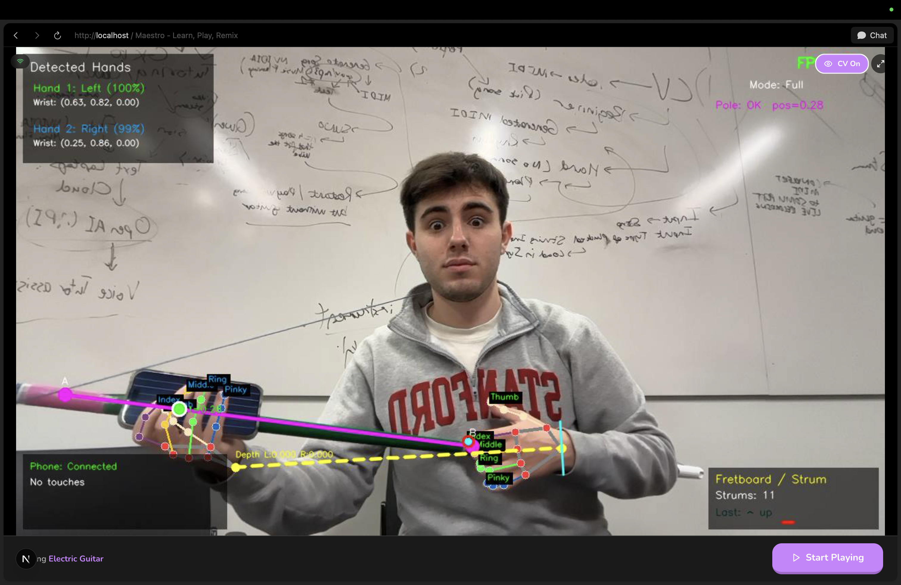

<p align="center">
  <h1 align="center"><b>Maestro</b></h1>
  <p align="center">
  ✶ Real-Time Air Instrument & AI Music Coach ✶
    <br />
    <a href="https://devpost.com/software/maestro-n0uqyz">Devpost »</a>
    &nbsp;·&nbsp;
    Run locally: <code>uv run treehacks-server</code> + <code>cd website && npm run dev</code>
    <br />
  </p>
</p>

Maestro is a real-time **air instrument** system that combines **computer vision** (hand tracking + strum detection on a laptop) with a **mobile fretboard app** (multi-touch on iPhone). The two talk over WebSocket; on each strum, MIDI notes are generated and played through the laptop via FluidSynth. An optional **Next.js web app** streams the camera feed to the browser and connects to an **AI coaching backend** (Qwen2.5-VL + Music Flamingo on an ASUS GX10) for form and performance feedback.



## Motivation

Learning an instrument is hard—and getting *actionable* feedback on posture, hand position, and rhythm usually requires a teacher in the room. We wanted to turn a laptop webcam and a phone into a playable string instrument *and* hook it into an AI coach that can see and hear you.

Maestro takes the “air guitar” idea seriously: you form a **neck line** with your two wrists in front of the camera, **strum** with one hand across that line, and use the **phone** as a multi-touch fretboard to choose strings and frets. The system fuses hand distance, strum velocity, and touch data into MIDI and plays it in real time. When the browser bridge and GX10 are in the loop, a single frame + audio clip can be sent to a dual-agent coach (visual form + audio performance) for structured, culturally aware feedback—so practice becomes more than just playing into the void.

## Technical Overview

- **Python backend (`src/`)** — MediaPipe Hand Landmarker (LIVE_STREAM), OpenCV overlay, strum detection (perpendicular crossing velocity), note engine (string + fret + pole position → MIDI), FluidSynth playback. WebSocket server on port 8765 for the phone fretboard. Run with `uv run treehacks` (OpenCV window) or `uv run treehacks-server` (headless, for browser).
- **Browser bridge** — `treehacks-server` runs a second WebSocket on port 8766: binary JPEG frames out, JSON commands in. Lets the Next.js app show the camera feed and control start/stop without a local OpenCV window.
- **Next.js 15 web app (`website/`)** — TypeScript/Tailwind app for play mode, tutor flows, analysis, and integration with the GX10 dual-agent coach (video frame + audio → visual + audio feedback).
- **GX10 dual-agent coach** — Optional Python service on the ASUS GX10: Qwen2.5-VL for visual form (posture, hands, technique) and Music Flamingo for audio (tempo, rhythm, style). See [GX10_INTEGRATION.md](GX10_INTEGRATION.md).
- **iOS fretboard (`fretboard/`)** — Native Swift/SwiftUI app: multi-touch strings, WebSocket client to the Python backend, CoreMotion optional. Connect to the laptop’s IP and play.

## File structure

```text
treehacks/
  src/                          # Python backend (air instrument + MIDI)
    main.py                      # OpenCV window entry (uv run treehacks)
    server.py                    # Browser bridge + GX10 (uv run treehacks-server)
    config.py                    # Paths, thresholds, ports, note tuning
    hand_tracking.py             # Hand ID, strum detection, landmark math
    drawing.py                   # OpenCV overlay (neck line, panels, notes)
    note_engine.py               # String/fret/pole/velocity → MIDI
    audio_engine.py              # FluidSynth wrapper
    websocket_server.py          # Phone fretboard WS (port 8765)
    pole_detection.py            # Magenta-tape pole (hand position → octave)
    models.py                    # FretboardState, PhoneState, PoleState, etc.
  website/                      # Next.js 15 app
    app/
      api/                       # audio-coach, analysis, realtime, suno, etc.
      play/                      # Play / live camera
      tutor/                     # Session, personality, summary
      analysis/, remixes/, ...
    components/
    lib/
  fretboard/                     # iOS app (Swift/SwiftUI)
    fretboard/
      ContentView.swift          # WebSocketManager, WelcomeScreen, FretboardScreen
      RawTouchView               # Multi-touch → normalized (x,y) + string
  demo/
    original.png                 # Demo screenshot
  hand_landmarker.task           # MediaPipe model (project root)
  soundfont.sf2                 # FluidSynth SoundFont (project root)
  pyproject.toml                 # Python deps (uv)
  CONTEXT.md                     # Architecture, protocol, module roles
  GX10_INTEGRATION.md            # GX10 endpoints, env, usage
  README.md
```

## Running the stack

**Python (from project root):**

- OpenCV + camera + phone WS:  
  `uv run treehacks` or `uv run python -m src.main`
- Headless browser bridge (for web app):  
  `uv run treehacks-server` or `uv run python -m src.server`

**System:** `brew install fluidsynth`. Place `hand_landmarker.task` and a `soundfont.sf2` at project root (see CONTEXT.md).

**Web app:**  
`cd website && npm install && npm run dev`

**iOS:** Open `fretboard/` in Xcode, build, enter the laptop’s IP on the welcome screen.

## API (summary)

- **WebSocket 8765** — Phone fretboard → Python. JSON `{ "touches": [ { "id", "x", "y", "string" } ] }`.
- **WebSocket 8766** — Browser ↔ `treehacks-server`. Binary: JPEG frames. JSON: `{"action":"start"|"stop"}`, status, MIDI events.
- **GX10** — `POST /dual-coach` with `image_base64`, `audio_base64`, `culture`, `instrument`. Returns `visual_coach` (Qwen2.5-VL) and `audio_coach` (Music Flamingo). See [GX10_INTEGRATION.md](GX10_INTEGRATION.md).

## Conventions

- Python: `src/` package, relative imports, config and assets at project root.
- Entry points: `uv run treehacks` (OpenCV), `uv run treehacks-server` (browser + GX10).
- Next.js: App Router, TypeScript, Tailwind.

## License

Apache-2.0. See `LICENSE` for details.
